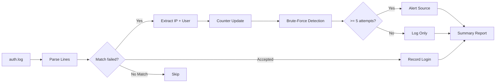

# LogWarden

Auth log analyzer. Scans `/var/log/auth.log` for failed SSH attempts, brute-force patterns, and suspicious IPs. Quick triage for compromised or attacked servers.

## How it works



## Usage

```bash
# Analyze auth log
python3 logwarden.py /var/log/auth.log

# Export as JSON
python3 logwarden.py /var/log/auth.log -o report.json

# Custom thresholds
python3 logwarden.py /var/log/auth.log --top-users 20 --min-attempts 3
```

## Sample Output

```
============================================================
  LogWarden Analysis Report
  File: /var/log/auth.log
============================================================

  Total lines parsed: 15234
  Failed auth attempts: 892
  Accepted logins: 12
  Invalid user attempts: 445
  Unique attacking IPs: 127

  Top attacked usernames:
    root                 423 attempts
    admin                89 attempts
    ubuntu               45 attempts
    user                 32 attempts
    test                 28 attempts

  Brute-force sources (>=5 attempts):
    103.235.46.92        234 attempts  (first: Jul 14 03:12:31, last: Jul 14 13:48:12)
    185.220.101.42      156 attempts  (first: Jul 13 22:04:15, last: Jul 14 11:22:08)
    45.33.32.156         89 attempts  (first: Jul 12 01:45:03, last: Jul 14 09:33:41)
```

## Features

- **SSH brute-force detection** — flags IPs with 5+ failed attempts
- **User enumeration** — shows which accounts are being targeted most
- **Accepted login tracking** — distinguishes legit access from attacks
- **JSON export** — machine-readable for pipeline integration
- **Custom thresholds** — adjust sensitivity per environment

## Project Structure

```
LogWarden/
├── logwarden.py
├── README.md
├── LICENSE
├── requirements.txt
├── tests/
│   └── test_logwarden.py
└── docs/
    └── engineering-report.md
```

## License

MIT
